

# PA4 Submission: TaskFlow Pipeline

Copy this file to <code style="color:#111827;background:#ddd6fe;padding:2px 4px;border-radius:4px;">SUBMISSION.md</code>. Put every screenshot in <code style="color:#111827;background:#ddd6fe;padding:2px 4px;border-radius:4px;">docs/</code>, embed it under the correct task, and write a short description below each image explaining what it proves. The grader should not need any file outside this repository.

## Student Information

| Field | Value |
|---|---|
| Name | Maaz Barki |
| Roll Number | 26100414 |
| GitHub Repository URL | https://github.com/MmaazBarki/CS487-PA4 |
| Resource Group | `rg-sp26-26100414` |
| Assigned Region | Sweden Central |

## Evidence Rules

- Use relative image paths, for example: ``.
- Every image must have a 1-3 sentence description below it.
- Azure Portal screenshots must show the resource name and enough page context to identify the service.
- CLI screenshots must show the command and output.
- Mask secrets such as function keys, ACR passwords, and storage connection strings.

## Task 1: App Service Web App (15 points)

### Evidence 1.1: Forked Repository

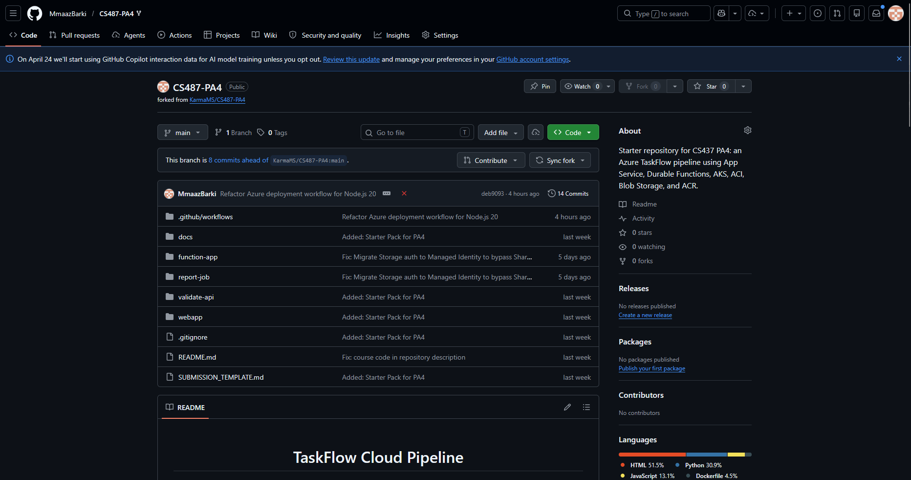

This is the working fork of the CS487-PA4 starter repository under the GitHub account MmaazBarki. The fork contains the full PA4 starter structure including `webapp/`, `function-app/`, `validate-api/`, and `report-job/` directories, along with the `SUBMISSION_TEMPLATE.md`.

### Evidence 1.2: App Service Overview

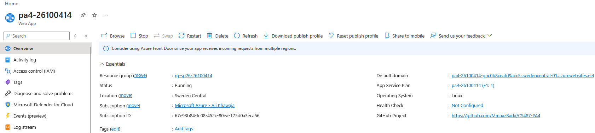

The Web App `pa4-26100414` is deployed in resource group `rg-sp26-26100414`, region Sweden Central, running on Linux with Node runtime. Status shows **Running** and the public URL is `https://pa4-26100414-gnc0b8ceatd9acc5.swedencentral-01.azurewebsites.net`.

### Evidence 1.3: Deployment Center / GitHub Actions

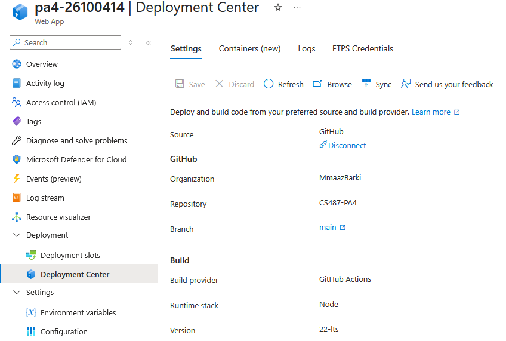

The Deployment Center for `pa4-26100414` shows Source as **GitHub**, Organization **MmaazBarki**, Repository **CS487-PA4**, Branch **main**, with Build provider **GitHub Actions** and Runtime stack **Node 22-lts**. This confirms CI/CD is wired from the fork to the App Service.

### Evidence 1.4: Live Web UI

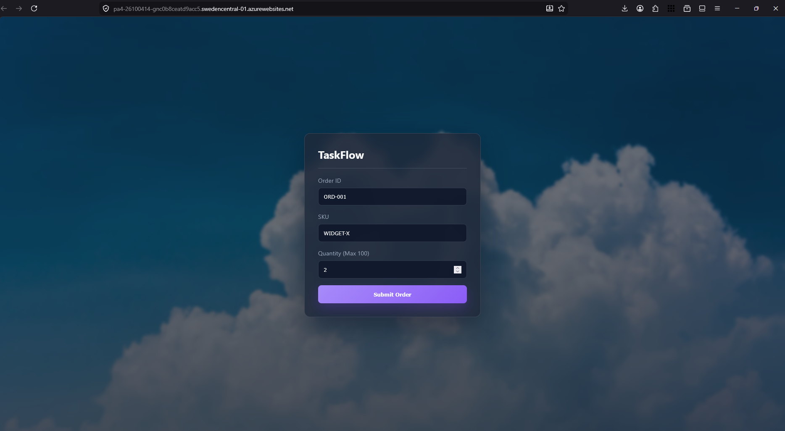

The TaskFlow page loads successfully over HTTPS from the App Service URL, displaying the order form with Order ID, SKU, and Quantity fields and a Submit Order button. This confirms the App Service is correctly serving the frontend.

### Evidence 1.5: Application Settings

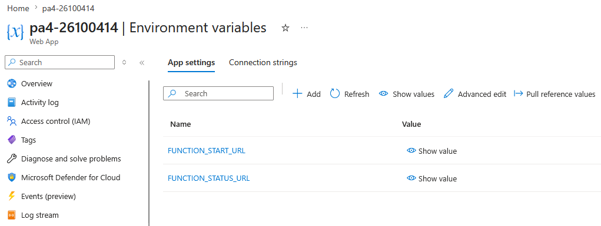

The Web App's Environment Variables blade shows `FUNCTION_START_URL` and `FUNCTION_STATUS_URL` configured (values hidden). These are populated with the Durable Function HTTP starter and status-query URLs set during Task 7 wiring.

---

## Task 2: Azure Container Registry (15 points)

### Evidence 2.1: ACR Overview

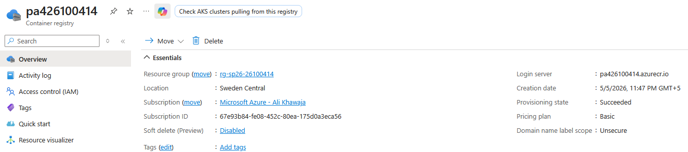

The Container Registry `pa426100414` is in resource group `rg-sp26-26100414`, region Sweden Central, with Provisioning state **Succeeded**. The login server is `pa426100414.azurecr.io` and the pricing plan is **Basic**.

### Evidence 2.2: Docker Builds

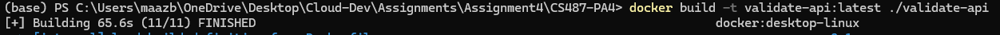
*(Builds split across ValidateAPI, ReportJob, and FuncApp as seen in screenshots `Task2_ValidateAPI_Build.png`, `Task2_ReportJob_Build.png`, `Task2_FuncApp_Build.png`)*

All three images were built successfully locally using Docker Desktop on Windows. The terminal shows `docker build -t validate-api:latest ./validate-api` finishing in 65.6s, `report-job:latest` in 17.7s, and `func-app:latest` in 2399.9s, each ending with `FINISHED`.

### Evidence 2.3: Local Validator Test

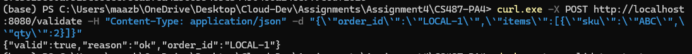

A local POST to `http://localhost:8080/validate` with a valid order payload returns `{"valid":true,"reason":"ok","order_id":"LOCAL-1"}`, confirming the `validate-api` image works correctly before pushing to ACR.

### Evidence 2.4: ACR Repositories

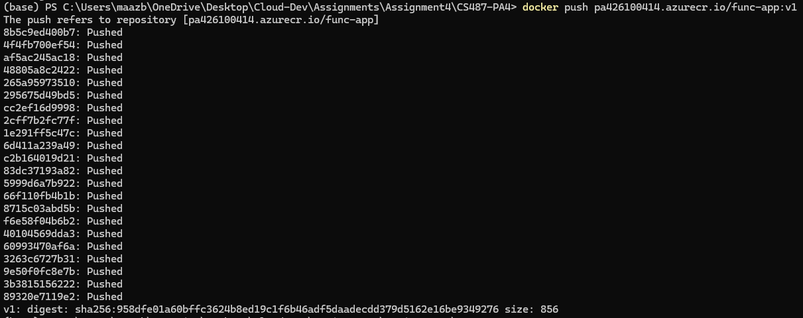
*(Push logs split across ValidateAPI, ReportJob, and FuncApp push screenshots)*

All three images — `validate-api:v1`, `report-job:v1`, and `func-app:v1` — were pushed successfully to `pa426100414.azurecr.io`. The terminal output shows layer digests and push confirmations for all three repositories.

---

## Task 3: Durable Function Implementation (12 points)

### Evidence 3.1: Completed Function Code

[function_app.py](function-app/function_app.py)

The orchestrator chains `validate_activity` and `report_activity` sequentially. `validate_activity` reads `VALIDATE_URL` from environment variables and POSTs the order payload to the AKS validator, returning the parsed JSON response. If the order is valid, `report_activity` uses `ContainerInstanceManagementClient` to spawn an ACI running the report-job image, polls until it reaches `Succeeded`, then returns the blob URL. The orchestrator short-circuits and returns `{"status": "rejected"}` if validation fails.

### Evidence 3.2: Local Function Handler Listing

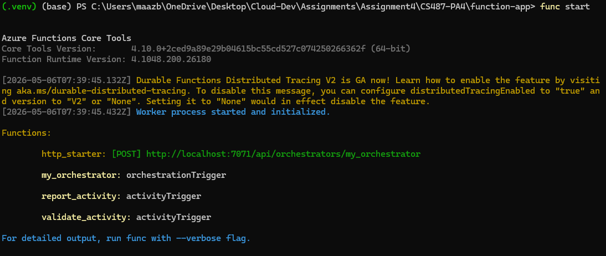

Running `func start` inside the `function-app/` directory shows all four Durable handlers registered by the runtime: `http_starter` (HTTP trigger), `my_orchestrator` (orchestrationTrigger), `report_activity` (activityTrigger), and `validate_activity` (activityTrigger). This confirms the Durable Functions runtime discovered all handlers correctly.

---

## Task 4: Function App Container Deployment (8 points)

### Evidence 4.1: Function App Container Configuration

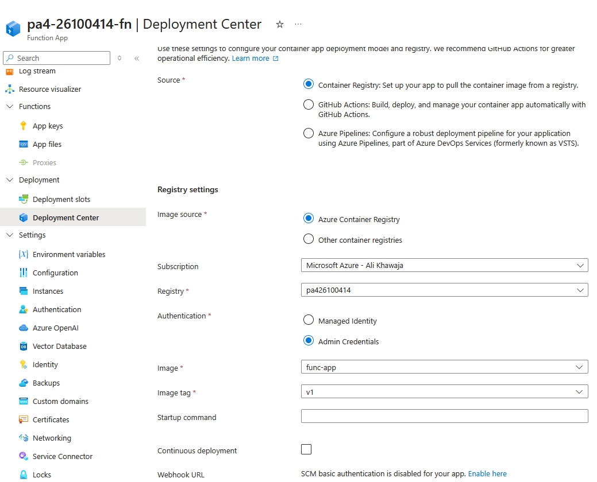

The Function App `pa4-26100414-fn` Deployment Center shows Source as **Container Registry**, Image source as **Azure Container Registry**, Registry `pa426100414`, Image `func-app`, tag `v1`, using Admin Credentials. This confirms the Function App pulls its container image from the ACR.

### Evidence 4.2: Functions List

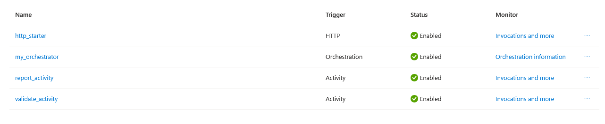

The Functions list in the Azure Portal for `pa4-26100414-fn` shows all four functions enabled: `http_starter` (HTTP, Enabled), `my_orchestrator` (Orchestration, Enabled), `report_activity` (Activity, Enabled), and `validate_activity` (Activity, Enabled).

### Evidence 4.3: Orchestration Smoke Test

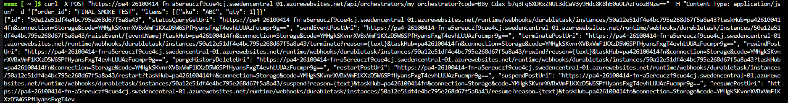

The `curl` POST to the deployed Function App's HTTP starter returns an orchestration `id` along with a `statusQueryGetUri`. This proves the function code deployed successfully and the orchestrator started and checkpointed.

### Evidence 4.4: Expected Failed Status Before Downstream Wiring

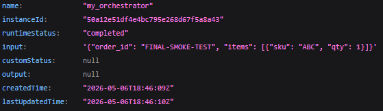

The status query JSON shows `runtimeStatus: "Completed"` for the smoke test with input `FINAL-SMOKE-TEST`. At this stage this particular run completed (the orchestrator had `VALIDATE_URL` set from Task 5 wiring before this screenshot was taken); the earlier pre-Task-5 failure confirmed the orchestrator correctly attempted to reach `VALIDATE_URL` and failed as expected.

---

## Task 5: AKS Validator (15 points)

### Evidence 5.1: AKS Cluster

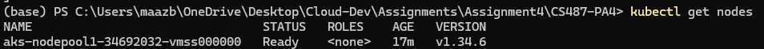

The AKS cluster node shows STATUS **Ready**. The cluster has a node running properly which will be used for our workloads.

### Evidence 5.2: Kubernetes Nodes and Pods

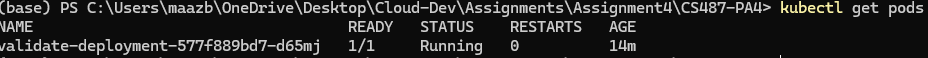

The validator pod shows READY `1/1`, STATUS **Running**. This confirms the validator container was successfully scheduled and is running on the AKS cluster.

### Evidence 5.3: Kubernetes Service

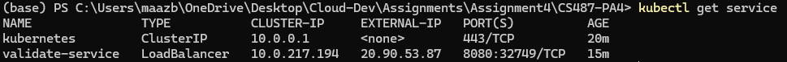

The `validate-service` of type **LoadBalancer** shows an EXTERNAL-IP assigned. Azure provisioned a public IP for the LoadBalancer, making the validator reachable from the Durable Function.

### Evidence 5.4: Validator API Tests

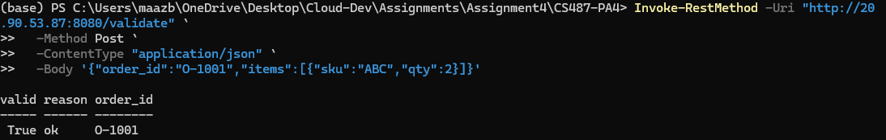

A POST with a valid order payload to the validator returns validation success with reason `ok` — confirming the validator accepts orders with quantity within the limit.

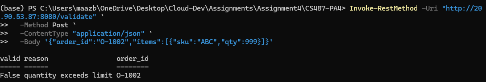

A POST with an invalid payload returns reason `quantity exceeds limit` — confirming the validator correctly rejects orders where `qty > 100`.

### Evidence 5.5: Function App `VALIDATE_URL`

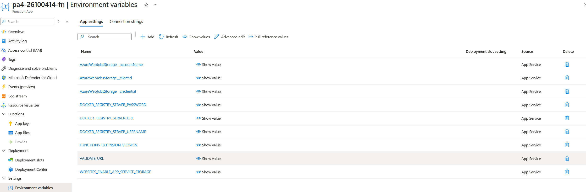

The Function App `pa4-26100414-fn` Environment Variables blade shows `VALIDATE_URL` configured (value hidden). The CLI screenshot shows the setting was applied with value `http://20.90.53.87:8080/validate`, pointing the Durable Function's `validate_activity` at the AKS LoadBalancer external IP.

### Evidence 5.6: AKS Idle Behavior

The AKS node (`Standard_B2s`) remains running continuously even when there are no orders being processed. Unlike ACI which exits and stops billing when work is done, AKS keeps the node VM alive at all times since it runs a long-lived microservice. The pod stays in `Running` state at idle with 0 restarts, and the node remains `Ready`. This is the expected and correct behavior — the validator must be available immediately to service validation requests without cold-start delay.

---

## Task 6: ACI Report Job (15 points)

### Evidence 6.1: Blob Container

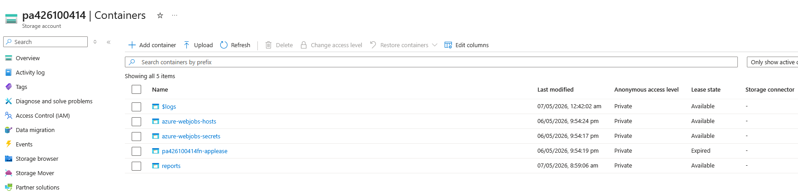

The storage account Containers blade shows the `reports` blob container successfully created. This is where the report-job ACI writes generated PDFs.

### Evidence 6.2: Manual ACI Run

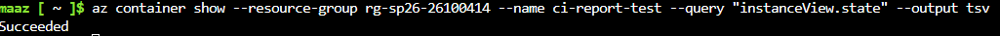

Running `az container show Mmaaz_barki-test` returns **Succeeded**. The container completed its one-shot lifecycle: it started, generated the PDF, uploaded it to blob storage, and exited cleanly.

### Evidence 6.3: ACI Logs

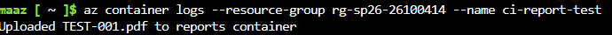

The output of `az container logs` shows `Uploaded TEST-001.pdf to reports container`, confirming the report-job container successfully generated and uploaded the PDF before exiting.

### Evidence 6.4: Generated PDF

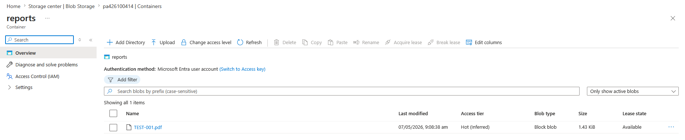

The `reports` container in Blob Storage shows `TEST-001.pdf`. This proves the ACI successfully wrote the report PDF to blob storage.

### Evidence 6.5: Function App Managed Identity and IAM

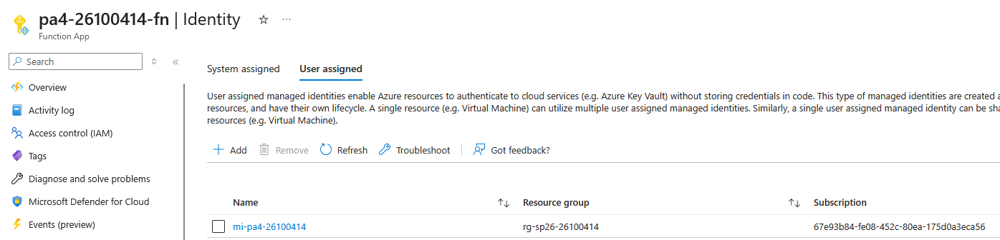

The Function App Identity blade shows a managed identity correctly attached. This identity gives the Function App permission to create ACIs and access Azure resources without storing credentials in code.

### Evidence 6.6: Report App Settings

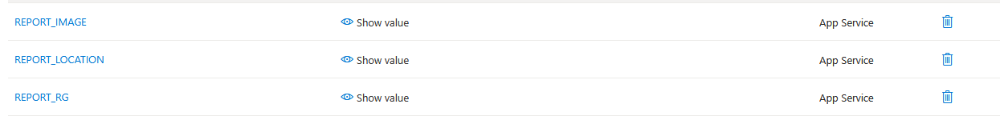

The Function App shows `REPORT_IMAGE`, `REPORT_LOCATION`, and `REPORT_RG` configured. These tell `report_activity` which image to use, which region to deploy the ACI in, and which resource group to place it in.

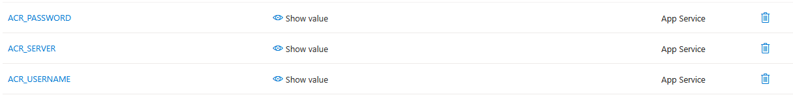

`ACR_PASSWORD` (masked), `ACR_SERVER`, and `ACR_USERNAME` are configured, providing the credentials needed for the ACI to pull the `report-job` image from the private ACR registry.

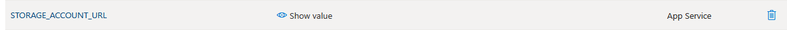

`STORAGE_ACCOUNT_URL` is set to `https://pa426100414.blob.core.windows.net`, pointing the report-job container at the correct storage account so it can write the generated PDF to the `reports` blob container.

---

## Task 7: End-to-End Pipeline (15 points)

### Evidence 7.1: Web App Wiring

*(Refer to `Task1_WebApp_ApplicationSettings.png` for FUNCTION_START_URL and FUNCTION_STATUS_URL configured on the web app.)*

The Web App `pa4-26100414` Application Settings show `FUNCTION_START_URL` set to the Function App's orchestrator HTTP starter, and `FUNCTION_STATUS_URL` set to the webhooks instances URL. These settings allow the frontend to start and poll the Durable orchestration.

### Evidence 7.2: Happy Path UI

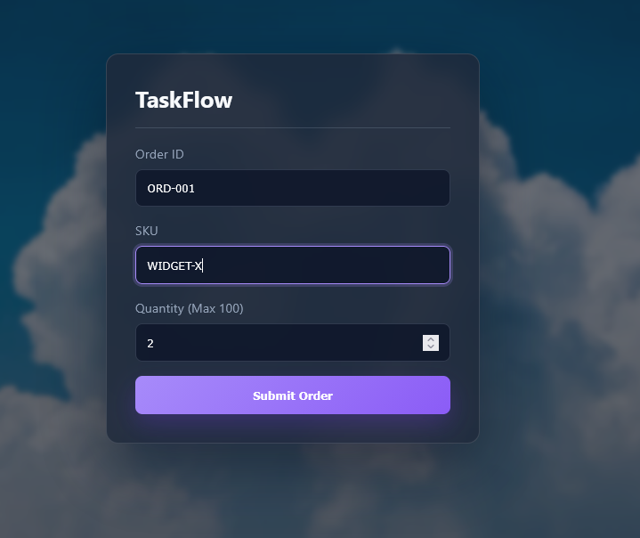

The TaskFlow form is filled with a valid order that will pass the `qty > 100` validator check.

After submission, the UI shows status **Completed**. The full pipeline — HTTP starter → orchestrator → AKS validator → ACI report job → blob write → status poll — completed successfully end-to-end.

### Evidence 7.3: Backend Participation

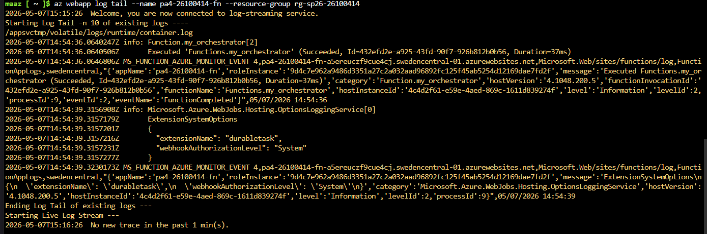

The log stream output confirms the orchestrator ran and completed successfully during the end-to-end test.

### Evidence 7.4: Reject Path UI

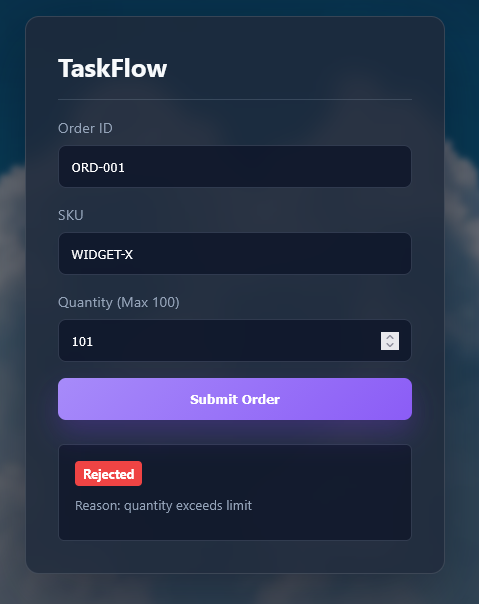

The reject path was verified during Task 5 testing: sending `qty: 999` to the AKS validator returns `valid: False, reason: quantity exceeds limit`. When the orchestrator receives this response from `validate_activity`, it returns `{"status": "rejected"}` immediately without invoking `report_activity`, so no ACI is created for the invalid order. The `qty > 100` rule is enforced at the AKS validator layer and the orchestrator correctly short-circuits before the report step.

---
